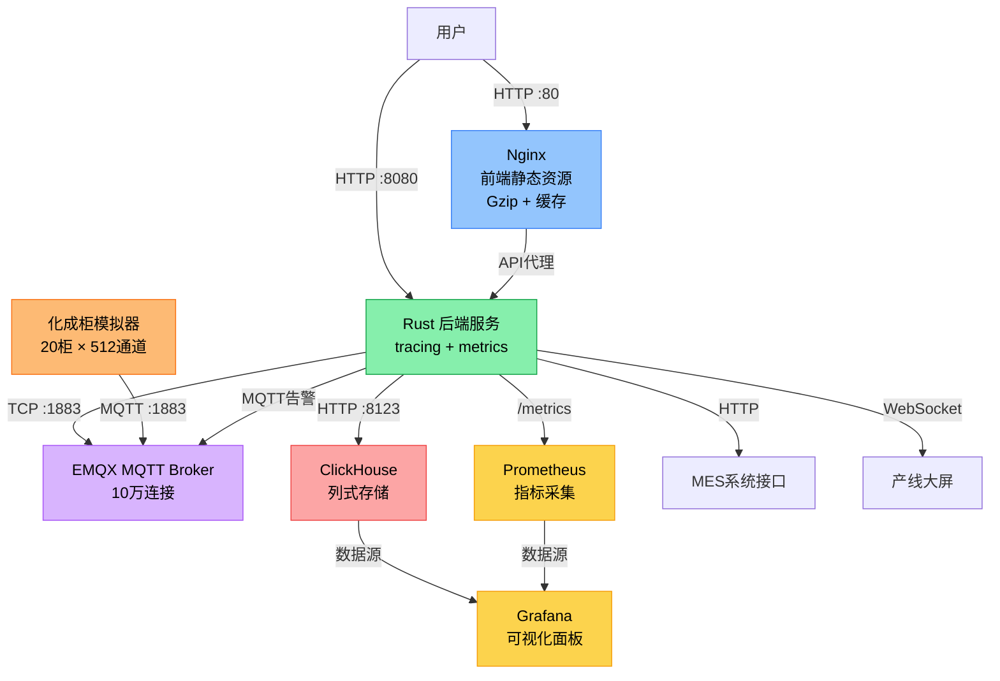
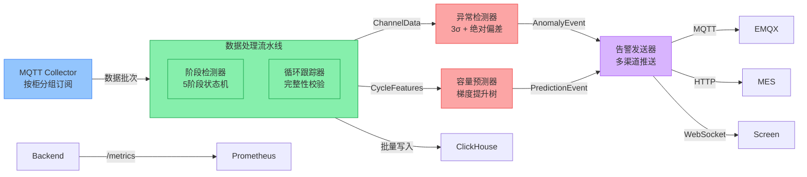

# 锂电池化成工艺监控与容量预测系统

基于 **Rust + ClickHouse + EMQX + Nginx** 构建的工业级锂电池化成工艺实时监控与容量预测系统。

## 📋 项目简介

- **监控规模**：20台化成柜 × 512通道 = 10,240个通道
- **数据频率**：每10秒上报一次电压、电流、温度、容量数据
- **数据吞吐**：约1,024条/秒，8800万条/天
- **工艺阶段**：预充 → 恒流充电 → 恒压充电 → 搁置 → 放电
- **核心功能**：实时监控、异常检测、容量预测、智能告警

---

## 🏗️ 系统架构

### 整体架构图



### 后端模块化架构



### 模块间通信（Tokio MPSC Channel）

```rust
// 消息流
mqtt_collector → (CabinetDataBatch) → data_pipeline
     ↓
     ├→ anomaly_detector → (AnomalyEvent) → alarm_sender
     ├→ capacity_predictor → (PredictionEvent) → alarm_sender
     ├→ stage_detector
     └→ clickhouse_writer (批量写入)

// 通道缓冲区
const CHANNEL_BUFFER_SIZE: usize = 1000;
```

---

## 📁 目录结构

```
.
├── backend/                    # Rust 后端服务
│   ├── src/
│   │   ├── main.rs           # 主入口，模块初始化
│   │   ├── mqtt_collector.rs # MQTT订阅接收模块 (按柜分组)
│   │   ├── data_pipeline.rs  # 数据处理流水线
│   │   ├── anomaly_detector.rs # 异常检测模块 (3σ+绝对偏差)
│   │   ├── capacity_predictor.rs # 容量预测模块 (GBDT)
│   │   ├── alarm_sender.rs   # 告警推送模块 (多渠道)
│   │   ├── metrics.rs        # Prometheus指标定义
│   │   ├── api.rs            # HTTP API接口 (Axum)
│   │   ├── config.rs         # 配置管理
│   │   ├── database.rs       # ClickHouse数据库操作
│   │   ├── models.rs         # 数据模型
│   │   ├── messages.rs       # 消息类型定义
│   │   └── stage_detector.rs # 工艺阶段检测
│   ├── model_config.json     # 电池模型配置（特征权重）
│   ├── Cargo.toml
│   ├── Dockerfile            # 多阶段构建
│   └── .dockerignore
│
├── frontend/                   # 前端静态资源
│   ├── index.html
│   ├── cabinet_panel.js     # 化成柜面板组件 (Canvas绘制)
│   ├── channel_detail.js    # 通道详情组件 (曲线图表)
│   └── styles.css
│
├── simulator/                  # 化成柜模拟器
│   ├── cabinet_simulator.py  # 模拟器主程序
│   ├── requirements.txt
│   └── Dockerfile
│
├── clickhouse/                 # ClickHouse配置
│   ├── init.sql            # 数据库初始化脚本 (分区+TTL)
│   └── config.xml          # ClickHouse配置
│
├── emqx/                       # EMQX MQTT Broker配置
│   └── emqx.conf           # EMQX主配置
│
├── prometheus/                 # Prometheus配置
│   └── prometheus.yml
│
├── grafana/                    # Grafana配置
│   ├── datasources/
│   └── dashboards/
│
├── docker-compose.yml       # Docker编排文件
├── nginx.conf              # Nginx配置 (Gzip+缓存)
├── .env.example            # 环境变量示例
└── README.md
```

---

## 🚀 快速开始

### 环境要求

| 软件 | 版本要求 | 说明 |
|------|----------|------|
| Docker | >= 24.0 | 容器运行时 |
| Docker Compose | >= 2.20 | 容器编排 |
| 内存 | >= 8GB | 建议16GB以上 |
| 磁盘 | >= 50GB | 数据存储 |

### 一键部署

#### 1. 克隆项目

```bash
git clone <repository-url>
cd AI_solo_coder_task_A_032
```

#### 2. 配置环境变量

```bash
cp .env.example .env
```

根据需要修改 `.env` 中的配置，主要包括：

```env
# ClickHouse密码（生产环境必须修改）
CLICKHOUSE_PASSWORD=your_secure_password

# EMQX Dashboard密码
EMQX_DASHBOARD_PASSWORD=your_secure_password

# Grafana密码
GRAFANA_PASSWORD=your_secure_password

# 模拟器配置
SIM_NUM_CABINETS=20
SIM_CHANNELS_PER_CABINET=512
SIM_REPORT_INTERVAL=10
SIM_ABNORMAL_RATIO=0.03
```

#### 3. 创建数据目录

```bash
# Windows PowerShell
New-Item -ItemType Directory -Force -Path data/clickhouse, data/emqx/data, data/emqx/log, data/prometheus, data/grafana | Out-Null

# Linux/Mac
mkdir -p data/{clickhouse,emqx/data,emqx/log,prometheus,grafana}
```

#### 4. 启动核心服务

```bash
# 启动核心服务（后端 + 数据库 + MQTT + 前端）
docker-compose up -d

# 启动所有服务（含模拟器 + 监控）
docker-compose --profile all up -d

# 只启动模拟器
docker-compose --profile simulator up -d simulator

# 只启动监控
docker-compose --profile monitoring up -d
```

#### 5. 验证服务状态

```bash
# 查看所有服务状态
docker-compose ps

# 查看特定服务日志
docker-compose logs -f backend
docker-compose logs -f clickhouse
docker-compose logs -f emqx
```

#### 6. 访问系统

| 服务 | 地址 | 默认账号 |
|------|------|----------|
| 前端监控面板 | http://localhost | - |
| 后端API | http://localhost:8080 | - |
| EMQX Dashboard | http://localhost:18083 | admin / public |
| Prometheus | http://localhost:9090 | - |
| Grafana | http://localhost:3000 | admin / admin123 |
| ClickHouse | http://localhost:8123 | default / - |
| Rust服务指标 | http://localhost:8080/metrics | - |

#### 7. 常用命令

```bash
# 查看日志
docker-compose logs -f backend          # 后端日志
docker-compose logs -f simulator        # 模拟器日志
docker-compose logs -f clickhouse       # 数据库日志
docker-compose logs -f emqx             # MQTT Broker日志

# 服务管理
docker-compose stop                     # 停止所有服务
docker-compose down                     # 停止并清理容器
docker-compose down -v                  # 停止并清理数据卷（⚠️ 危险）
docker-compose restart backend          # 重启后端服务
docker-compose build --no-cache         # 重新构建所有镜像

# 数据库操作
docker exec -it battery-clickhouse clickhouse-client
docker exec -it battery-clickhouse clickhouse-client --query "SELECT count() FROM battery_monitor.channel_data"

# MQTT测试
docker exec -it battery-emqx emqx_ctl status
docker exec -it battery-emqx mosquitto_sub -t "battery/cabinet/1/data" -C 1
```

---

## 🎛️ 模拟器配置说明

### 环境变量配置

| 变量名 | 默认值 | 说明 |
|--------|--------|------|
| `SIM_NUM_CABINETS` | 20 | 化成柜数量 (1-100) |
| `SIM_CHANNELS_PER_CABINET` | 512 | 每柜通道数 (1-512) |
| `SIM_REPORT_INTERVAL` | 10 | 数据上报间隔（秒） |
| `SIM_ABNORMAL_RATIO` | 0.03 | 异常通道比例 (0-1) |
| `SIM_ANOMALY_DURATION_MIN` | 60 | 异常持续最小时间（秒） |
| `SIM_ANOMALY_DURATION_MAX` | 300 | 异常持续最大时间（秒） |
| `SIM_RATED_CAPACITY` | 3.2 | 额定容量（Ah） |
| `SIM_CAPACITY_FACTOR_MIN` | 0.85 | 容量因子最小值 |
| `SIM_CAPACITY_FACTOR_MAX` | 1.05 | 容量因子最大值 |
| `SIM_BATCH_SIZE` | 64 | MQTT消息批量大小 |
| `SIM_MQTT_QOS` | 1 | MQTT QoS级别 (0/1/2) |

### 异常类型

模拟器支持4种异常类型，按比例随机触发：

| 异常类型 | 说明 | 表现形式 |
|---------|------|---------|
| `voltage_abnormal` | 电压异常 | 电压随机波动 ±0.3V |
| `current_abnormal` | 电流异常 | 电流随机波动 ±0.5A |
| `temperature_high` | 高温异常 | 温度升高 5-15°C |
| `capacity_low` | 容量异常 | 容量降低 30% |

### 自定义测试场景

```bash
# 场景1：高异常比例（10%异常，用于告警测试）
SIM_ABNORMAL_RATIO=0.10 docker-compose --profile simulator up -d simulator

# 场景2：无异常场景（用于基准测试）
SIM_ABNORMAL_RATIO=0.00 docker-compose --profile simulator up -d simulator

# 场景3：快速测试（1秒上报，小容量）
SIM_REPORT_INTERVAL=1 SIM_NUM_CABINETS=2 SIM_CHANNELS_PER_CABINET=64 docker-compose --profile simulator up -d simulator

# 场景4：大容量测试（100柜 × 512通道）
SIM_NUM_CABINETS=100 docker-compose --profile simulator up -d simulator
```

### 工艺曲线模拟

模拟器严格按照5个工艺阶段模拟真实充放电曲线：

| 阶段 | 电压范围 | 电流范围 | 持续时间 |
|------|----------|----------|----------|
| 预充 | 2.5V - 3.0V | 0.05A - 0.1A | 30分钟 |
| 恒流充电 | 3.0V - 4.2V | 1.5A - 1.6A | 120分钟 |
| 恒压充电 | 4.15V - 4.2V | 0.1A - 1.5A | 60分钟 |
| 搁置 | 3.9V - 4.1V | 0A | 30分钟 |
| 放电 | 3.8V - 2.8V | -1.6A - -1.5A | 90分钟 |

每个完整循环约5.5小时，模拟器会从随机阶段开始，避免所有通道同步。

---

## 📊 ClickHouse 数据存储配置

### 数据分区策略

```sql
-- 按月分区（时序数据表）
PARTITION BY toYYYYMM(timestamp)

-- 按日期分区（统计摘要表）
PARTITION BY date

-- 排序键设计（便于按柜按通道查询）
ORDER BY (cabinet_id, channel_id, timestamp)
```

### TTL自动过期策略

| 表名 | TTL | 说明 |
|------|-----|------|
| `channel_data` | 90天 | 原始通道数据 |
| `channel_stage_summary` | 90天 | 阶段统计摘要 |
| `capacity_prediction` | 90天 | 容量预测结果 |
| `cycle_features` | 90天 | 循环特征 |
| `cabinet_stats` | 90天 | 化成柜统计 |
| `control_commands` | 90天 | 控制命令 |
| `anomalies` | 180天 | 异常记录（保留更久） |
| `alerts` | 180天 | 告警记录（保留更久） |
| `channel_status` | 永久 | 通道最新状态 |

### 性能优化配置

```xml
<!-- config.xml -->
<merge_tree>
    <index_granularity>8192</index_granularity>
    <index_granularity_bytes>10485760</index_granularity_bytes>
    <ttl_only_drop_parts>1</ttl_only_drop_parts>
    <max_number_of_merges_with_ttl_in_pool>2</max_number_of_merges_with_ttl_in_pool>
</merge_tree>

<!-- 压缩策略 -->
<compression>
    <case>
        <min_part_size>1073741824</min_part_size>
        <method>zstd</method>
        <level>1</level>
    </case>
    <case>
        <method>LZ4</method>
    </case>
</compression>
```

### 跳数索引加速查询

```sql
-- 通道数据表索引
ALTER TABLE channel_data ADD INDEX idx_voltage voltage TYPE minmax GRANULARITY 4;
ALTER TABLE channel_data ADD INDEX idx_temperature temperature TYPE minmax GRANULARITY 4;
ALTER TABLE channel_data ADD INDEX idx_cycle cycle_index TYPE set(256) GRANULARITY 4;
ALTER TABLE channel_data ADD INDEX idx_stage stage TYPE set(8) GRANULARITY 4;

-- 异常表索引
ALTER TABLE anomalies ADD INDEX idx_severity severity TYPE set(8) GRANULARITY 4;
ALTER TABLE anomalies ADD INDEX idx_anomaly_type anomaly_type TYPE set(16) GRANULARITY 4;
```

---

## 🔍 Rust 服务日志与指标

### Tracing 日志配置

使用 `tracing` 框架实现结构化日志：

```rust
// main.rs
tracing_subscriber::registry()
    .with(EnvFilter::from_default_env())
    .with(
        fmt::layer()
            .with_span_events(FmtSpan::NEW | FmtSpan::CLOSE)
            .with_target(true)
            .with_thread_ids(true)
            .with_file(true)
            .with_line_number(true),
    )
    .init();
```

### 日志级别控制

通过环境变量 `RUST_LOG` 控制：

```bash
# 仅错误日志
RUST_LOG=error

# 调试模式
RUST_LOG=debug

# 模块级别控制
RUST_LOG=info,battery_monitor=debug,reqwest=warn

# JSON格式日志（生产环境推荐）
RUST_LOG_FORMAT=json
```

### Prometheus 指标

Rust服务暴露 `/metrics` 端点，包含以下指标：

| 指标名 | 类型 | 标签 | 说明 |
|--------|------|------|------|
| `mqtt_messages_received_total` | Counter | cabinet_id | 接收的MQTT消息总数 |
| `mqtt_bytes_received_total` | Counter | - | 接收的MQTT字节总数 |
| `channel_data_inserted_total` | Counter | - | 插入的数据点总数 |
| `anomalies_detected_total` | Counter | anomaly_type, severity | 检测到的异常数 |
| `predictions_made_total` | Counter | model_version | 容量预测总数 |
| `alerts_generated_total` | Counter | alert_level, alert_type | 生成的告警数 |
| `active_channels` | Gauge | cabinet_id | 活跃通道数 |
| `abnormal_channels` | Gauge | cabinet_id | 异常通道数 |
| `paused_channels` | Gauge | cabinet_id | 暂停通道数 |
| `system_capacity_ratio` | Gauge | - | 系统平均容量比 |
| `prediction_latency_seconds` | Histogram | - | 预测延迟 |
| `mqtt_processing_latency_ms` | Histogram | - | MQTT处理延迟 |
| `db_insert_latency_ms` | Histogram | - | 数据库插入延迟 |

### 查看指标

```bash
# 查看Rust服务指标
curl http://localhost:8080/metrics

# 查看Prometheus目标状态
open http://localhost:9090/targets
```

---

## 🌐 Nginx 前端配置

### Gzip 压缩策略

```nginx
gzip on;
gzip_comp_level 6;
gzip_min_length 1024;
gzip_types
    text/plain
    text/css
    text/javascript
    application/javascript
    application/json
    application/xml
    image/svg+xml
    application/x-font-ttf;
```

### 缓存策略

| 资源类型 | 缓存时间 | Cache-Control |
|----------|----------|---------------|
| JS/CSS/图片/字体 | 1年 | `public, immutable` |
| HTML | 1小时 | `public, max-age=3600, must-revalidate` |
| API响应 | 1分钟 | 动态缓存 |

### 安全头

```nginx
add_header X-Content-Type-Options nosniff;
add_header X-Frame-Options SAMEORIGIN;
add_header X-XSS-Protection "1; mode=block";
```

---

## ⚠️ 告警规则

### 一级告警（单通道）

- **容量降级**：容量低于额定值 90% → 触发一级告警
- **电压异常**：电压偏离同柜均值超过 3σ 且绝对偏差 > 20mV → 触发一级告警并自动暂停

### 二级告警（化成柜）

- **设备告警**：同一化成柜超过 10% 通道异常 → 触发二级告警

### 告警推送渠道

1. **MQTT 推送**：Topic `battery/alerts`
2. **产线大屏**：WebSocket 实时推送
3. **MES 系统**：HTTP 接口推送

---

## 🛡️ 生产环境部署建议

### 1. 修改默认密码

```env
# .env
CLICKHOUSE_PASSWORD=your_strong_password
EMQX_DASHBOARD_PASSWORD=your_strong_password
GRAFANA_PASSWORD=your_strong_password
```

### 2. 启用 MQTT 认证

```bash
# emqx/emqx.conf
auth.anonymous = false

# .env
MQTT_USERNAME=your_mqtt_user
MQTT_PASSWORD=your_mqtt_password
```

### 3. 配置 HTTPS

建议使用 Traefik 或 Nginx 作为反向代理，配置 SSL 证书。

### 4. 数据备份

```bash
# ClickHouse 数据备份脚本
docker exec battery-clickhouse clickhouse-backup create

# 定时备份（crontab）
0 2 * * * /usr/bin/docker exec battery-clickhouse clickhouse-backup create >> /var/log/backup.log 2>&1
```

### 5. 监控告警

配置 Prometheus Alertmanager，实现：
- 服务宕机告警
- 磁盘空间告警
- 内存使用率告警
- 关键指标异常告警

---

## 🔍 故障排查

### 常见问题

**1. 后端无法连接 MQTT**

```bash
# 检查MQTT容器状态
docker-compose ps mqtt-broker

# 查看MQTT日志
docker-compose logs mqtt-broker

# 测试MQTT连接
docker run --rm --network battery-network eclipse-mosquitto mosquitto_pub -h mqtt-broker -t test -m "hello"
```

**2. ClickHouse 连接失败**

```bash
# 检查ClickHouse状态
curl http://localhost:8123/ping

# 查看数据库日志
docker-compose logs clickhouse

# 手动连接测试
docker exec -it battery-clickhouse clickhouse-client
```

**3. 模拟器不发送数据**

```bash
# 查看模拟器日志
docker-compose logs simulator

# 检查MQTT主题订阅
docker exec -it battery-emqx mosquitto_sub -t "battery/cabinet/1/data" -C 1
```

**4. 前端无法访问**

```bash
# 检查Nginx配置
docker exec battery-frontend nginx -t

# 查看Nginx错误日志
docker logs battery-frontend

# 检查前端文件
docker exec battery-frontend ls -la /usr/share/nginx/html/
```

**5. Rust 服务崩溃**

```bash
# 查看后端日志
docker-compose logs backend --tail=100

# 检查资源限制
docker stats battery-backend

# 查看系统日志
dmesg | grep -i oom
```

---

## 📈 性能估算

### 数据量估算（20柜 × 512通道）

| 指标 | 值 | 说明 |
|------|----|------|
| 上报频率 | 1,024条/秒 | 10240通道 ÷ 10秒 |
| 每日数据量 | 8847万条/天 | 1024 × 86400 |
| 每日存储量 | ~10GB/天 | 每条约120字节 |
| 90天存储量 | ~900GB | 含压缩和索引 |

### 资源需求

| 服务 | CPU | 内存 | 磁盘 |
|------|-----|------|------|
| ClickHouse | 4核 | 8GB | 1TB SSD |
| Rust Backend | 2核 | 2GB | - |
| EMQX | 2核 | 2GB | 20GB |
| Nginx | 1核 | 256MB | - |
| Simulator | 2核 | 1GB | - |
| Prometheus | 1核 | 1GB | 50GB |
| Grafana | 1核 | 256MB | 10GB |
| **总计** | **13核** | **14.5GB** | **1.08TB** |

---

## 📄 License

MIT License

---

## ⚠️ 注意事项

1. **生产环境请务必修改所有默认密码**
2. **建议配置 HTTPS 确保传输安全**
3. **定期备份 ClickHouse 数据**
4. **监控磁盘空间使用情况，避免数据溢出**
5. **模拟器仅用于测试，生产环境接入真实设备**
6. **首次启动需要等待 ClickHouse 初始化完成（约30秒）**

---

**如需技术支持，请查看各模块源代码或提交 Issue。**
